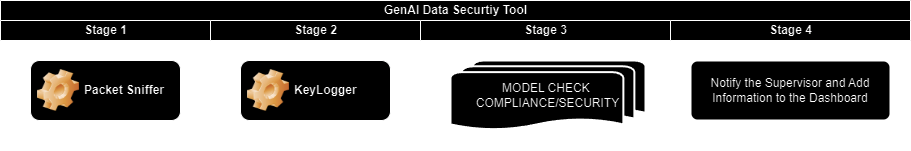
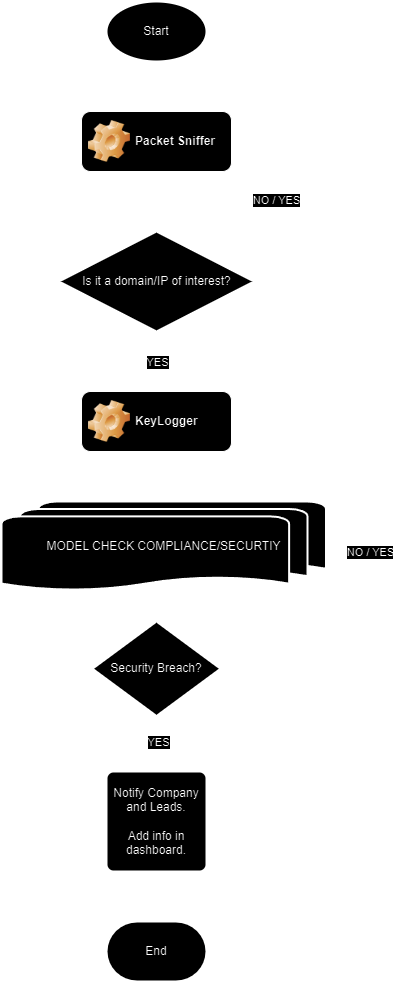

# genai-data-security-tool
Tool that checks what the user is searching for in generative AIs. Analyzing the content that the user is searching for in an LLM AI and checking whether the prompt made compromises the security of the company's data.
___

## Simplified Tool Diagram

- **Stage 1**
    - The Packet Sniffer module, will run continuously from OS startup.
    - If an IP/domain of interest is detected, it will enable stage 2.

    > IP/domain of interest is a list containing the IPs/domains of GenAI tools like ChatGPT, Claude, Gemini.

 

- **Stage 2**
    - The KeyLogger module will only be executed for packets that have an IP/domain of interest.

    - Storing the prompt made to the GenAI tool.

    - The stored prompt is immediately sent as input to the model that will evaluate whether the prompt is in accordance with the company's data security documentation.

    > company's data security documentation is a list of company data security documents and standards, which comply with rules such as LGPD.

 

- **Stage 3**
    - The LLM model that will evaluate whether the prompt stored by Ketlogger complies with the company's security policies.

 

- **Stage 4**
    - In the event of a breach of compliance or security violation, the employee's supervisor will be notified.
    - The information will be added to a dashboard to facilitate the analysis of the tool.

## Simplified Flowchart of Algorithm

...